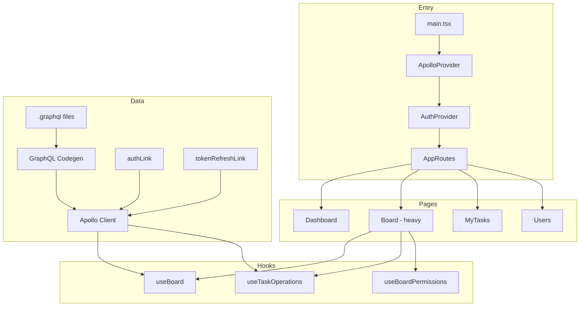

# Kanban Frontend — Project Review

A deep read-only review of the repository (~93 files, ~72 TS/TSX source files). Overall this is a **solid, feature-complete Kanban app** with a modern stack and sensible structure. It reads like strong intern/junior-mid work with clear room to grow in architecture, testing, and polish.

---

## Executive Summary


| Area            | Rating    | Notes                                                   |
| --------------- | --------- | ------------------------------------------------------- |
| Architecture    | Good      | Clear folders, hooks, GraphQL codegen                   |
| Code quality    | Fair–Good | Strict TS, but duplication and `any` usage              |
| U*X*            | *Good*    | *Loading/error states, modals, responsive nav*          |
| Security        | Fair      | JWT refresh works; `localStorage` tokens are a tradeoff |
| Performance     | Fair      | Redundant queries, kanban loads up to 1000 tasks        |
| Testing / CI    | Weak      | No tests, no CI pipeline                                |
| Maintainability | Fair      | `Board.tsx` is doing too much                           |


---


## What's Working Well


### 1. Modern, coherent stack

React 19, TypeScript (strict), Vite 8, Apollo Client 4, GraphQL Codegen, Tailwind 4, shadcn/ui, `@dnd-kit`, react-hook-form + Zod — all appropriate choices for this app.

### 2. Clean high-level structure

```
src/
├── apollo/       → client, auth link, token refresh
├── graphql/      → .graphql documents (source of truth)
├── gql/          → generated types
├── hooks/        → domain logic (board, tasks, auth, permissions)
├── pages/        → route-level screens
├── components/   → UI building blocks
└── context/      → auth state
```


### 3. Auth is thoughtfully implemented

- Session restore on boot via `MeDocument`
- JWT attach via `authLink`
- Silent token refresh with queueing in `tokenRefreshLink.ts`
- Fire-and-forget logout with local cleanup

```typescript
// src/context/AuthProvider.tsx
useEffect(() => {
  const restoreSession = async () => {
    const token = tokenStorage.getAccessToken();
    // ...
    try {
      const { data } = await client.query({
        query: MeDocument,
        fetchPolicy: "network-only",
      });
      // ...
    } catch {
      tokenStorage.clear();
      setUser(null);
    } finally {
      setLoading(false);
    }
  };
  restoreSession();
}, [client]);
```


### 4. Role-based routing and permissions

`ProtectedRoute`, `RoleHomeRedirect`, and `useBoardPermissions` give a real RBAC model (ADMIN / MANAGER / USER + board-level OWNER / MEMBER / VIEWER).

### 5. Good UX patterns

- `StatePanel` for loading / error / empty states
- `ConfirmationDialog` instead of `window.confirm()` (mostly)
- Optimistic drag-and-drop with `useOptimistic` + `useTransition`
- Forms validated with Zod


### 6. GraphQL workflow

`.graphql` files + codegen is the right pattern. Typed documents (`BoardDocument`, `TasksDocument`, etc.) reduce runtime mistakes.

---


## Issues & Recommendations


### Critical / High Priority


#### 1. `Board.tsx` is a god component (~525 lines)

It owns: filters, pagination, kanban + list views, modals, comments, board CRUD, drag-and-drop, and optimistic state.

**Recommendation:** Split into focused pieces, e.g.:

- `useBoardPageState()` — filters, view mode, modal state
- `BoardTaskModals` — task details + confirmations
- `useBoardTasks()` — kanban vs list queries

This is the single biggest maintainability issue.

#### 2. Redundant / overlapping data fetching

On the board page you run:

- `BoardDocument` (includes full `tasks` + `comments`)
- `TasksDocument` twice (list + kanban with `limit: 1000`)

`useBoard` returns `tasks`, but the page doesn't use them — kanban uses `TasksDocument` instead.

**Impact:** Extra network payload, harder cache reasoning, more `refetch()` calls.

**Recommendation:** Pick one source of truth:

- Kanban: `TasksDocument` only (drop tasks from `BoardDocument`), or
- Use `board.tasks` and drop the 1000-limit query


#### 3. No automated tests

No `*.test.ts(x)` files. `@types/jest` is installed but there's no Jest/Vitest runner.

**Recommendation:** Add Vitest + React Testing Library. Start with:

- `useBoardPermissions`
- `ProtectedRoute` / `RoleHomeRedirect`
- `tokenRefreshLink` queue behavior
- `TaskForm` validation


#### 4. Silent mutation failures

Only Login, Register, and Profile use `try/catch`. Board, MyTasks, and Users mutations can fail without user feedback.

**Recommendation:** Wire up `sonner` (already in `package.json`) or a shared `useMutationWithToast` wrapper.

#### 5. Profile update doesn't sync auth state

After `UpdateUserDocument`, the navbar still shows the old name until a full reload — `AuthContext` isn't updated.

**Recommendation:** Add `updateUser` to `AuthProvider`, or refetch `MeDocument` and call `setUser`.

---


### Medium Priority


#### 6. Widespread `Number(id)` comparisons

Used for user/task/member ID equality across permissions, filtering, and comments.

```typescript
// src/hooks/useBoardPermissions.ts
const currentMember = board.members?.find(
  (m) => Number(m.user.id) === Number(user.id)
);
```

**Risk:** Breaks or misbehaves with UUID/string IDs (`Number("abc")` → `NaN`).

**Recommendation:** Compare IDs as strings: `String(a) === String(b)`.

#### 7. Duplicated utilities

`formatDate` appears in **5 files** with different implementations. `STATUS_ORDER` is duplicated. `cn()` exists in both `src/lib/utils.ts` and `src/components/ui/utils.ts`.

**Recommendation:** Centralize in `src/lib/`:

- `formatDate.ts`
- `taskConstants.ts` (`STATUS_ORDER`, column labels)
- One `cn` import path (`@/lib/utils` per `components.json`)


#### 8. Dead / unused code


| Item                  | Status                                                             |
| --------------------- | ------------------------------------------------------------------ |
| `src/apollo/cache.ts` | Defined but never imported; `client.ts` uses plain `InMemoryCache` |
| `refresh.graphql`     | Exists; refresh uses inline query string in `tokenRefreshLink.ts`  |
| `sonner`              | In deps, never used                                                |
| `date-fns`            | In deps, never used                                                |
| `lucide`              | In deps; only `lucide-react` is imported                           |
| `@types/jest`         | No test runner                                                     |


#### 9. Routing inconsistencies

```typescript
// src/routes/AppRoutes.tsx
if (user.role === "MANAGER") {
  return <Navigate to="/manager" replace />;
}
```

- Managers land on `/manager`, but the navbar links to `/dashboard`
- `/manager` renders the same `Dashboard` as `/dashboard` — duplicate route
- Navbar active state uses exact match (`pathname === link.to`), so `/board/abc` won't highlight "Board"

**Recommendation:** One dashboard route for all roles, or make nav role-aware. Use `pathname.startsWith("/board")` for board highlighting.

#### 10. Loading UX gaps

`ProtectedRoute` and `RoleHomeRedirect` return `null` while loading → brief blank screen.

**Recommendation:** Shared `<AppLoading />` or skeleton.

#### 11. `MyTasks` does client-side filtering

Fetches up to 100 tasks, then filters assignee/search/status in the browser.

**Recommendation:** Add an `assigneeId` filter on the backend and pass it in `TasksDocument` variables.

#### 12. Kanban `limit: 1000` is a scalability ceiling

```typescript
// src/pages/boards/Board.tsx
useQuery(TasksDocument, {
  variables: {
    page: 1,
    limit: 1000,
    // ...
  },
});
```

Works for demos; won't scale. Consider per-column queries or virtualized lists later.

---


### Lower Priority / Polish


#### 13. Type safety leaks (`any`)

Notable in `useTaskOperations`, `TaskDetailsModal`, `BoardSelector`, `ProtectedRoute` (`user.role as any`).

**Recommendation:** Use generated GraphQL types (`User`, `BoardRole`, etc.) instead of `any`.

#### 14. Inconsistent UI primitives

`TaskForm` uses raw `<input>` / `<select>` while auth pages use shadcn `Input`. `Users.tsx` still uses `alert()`.

#### 15. Security notes (expected tradeoffs)

- Tokens in `localStorage` → XSS can steal sessions. `httpOnly` cookies are safer but need backend changes.
- Client-side permissions are UX only; backend must enforce (assumed).
- `window.location.href = "/login"` on refresh failure is abrupt; a router redirect + toast would be smoother.


#### 16. No CI/CD

No `.github/workflows`. No lint-on-PR, build check, or preview deploys.

**Recommendation:** Minimal pipeline: `npm run lint && npm run build`.

#### 17. README drift

README mentions `PrivateRoute`, dark mode, and `sonner` notifications — code uses `ProtectedRoute`, has dark CSS vars but no toggle, and no toasts.

#### 18. Minor naming

`SortableTaskcard.tsx` (filename) vs `SortableTaskCard` (component) — inconsistent casing.

---


## Architecture Diagram (Current Flow)




---


## Suggested Roadmap (Prioritized)


### Phase 1 — Quick wins (1–2 days)

1. Add global loading spinner for auth bootstrap
2. Wire `sonner` for mutation success/error
3. Fix profile → auth context sync
4. Remove unused deps (`date-fns`, `lucide`, `@types/jest`) or use them
5. Consolidate `formatDate` and `cn`
6. Replace `Number(id)` with string comparison


### Phase 2 — Architecture (3–5 days)

1. Refactor `Board.tsx` into smaller modules/hooks
2. Remove duplicate task fetching
3. Use `refresh.graphql` in token refresh (codegen document)
4. Use or delete `cache.ts`; add Apollo `typePolicies` for `tasks`, `boards`


### Phase 3 — Quality gate (ongoing)

1. Vitest + RTL for hooks and critical flows
2. GitHub Actions: lint + build
3. E2E (Playwright) for login → board → drag task

---


## Final Verdict

**Strengths:** Modern stack, real features (kanban DnD, RBAC, comments, pagination), typed GraphQL, and thoughtful auth refresh. The codebase is deployable and demonstrates solid full-stack frontend skills.

**Main gaps:** No tests/CI, `Board.tsx` complexity, redundant queries, silent errors, and duplication that will slow future changes.

**Overall grade: B+** — strong foundation for an intern/project app; with refactoring, tests, and UX polish it could reach production-grade quality.